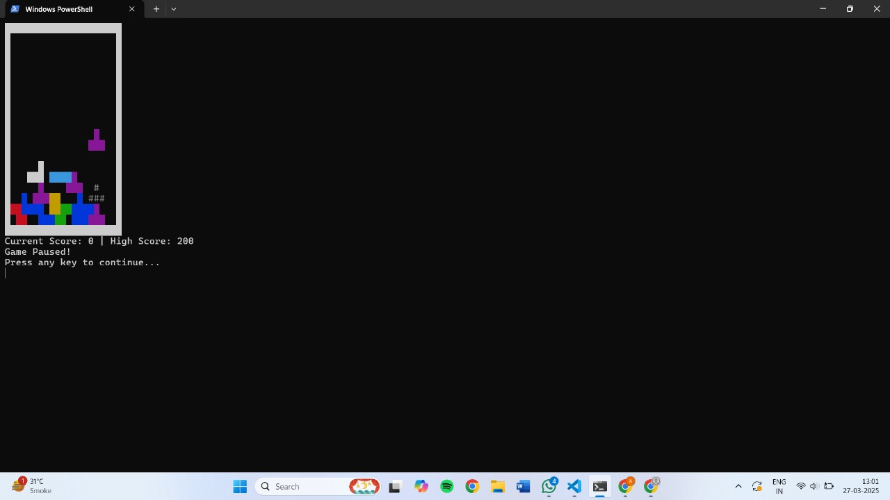
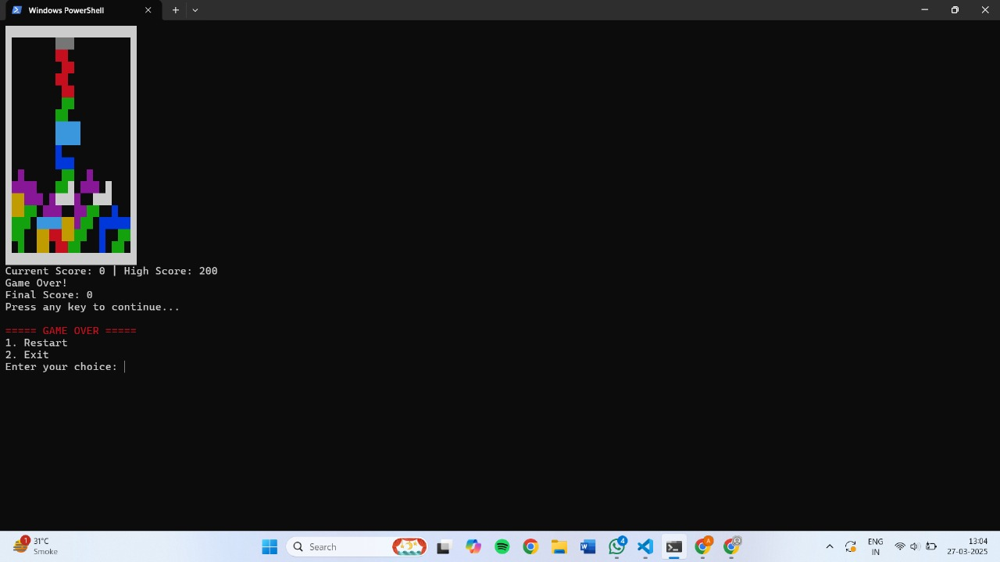
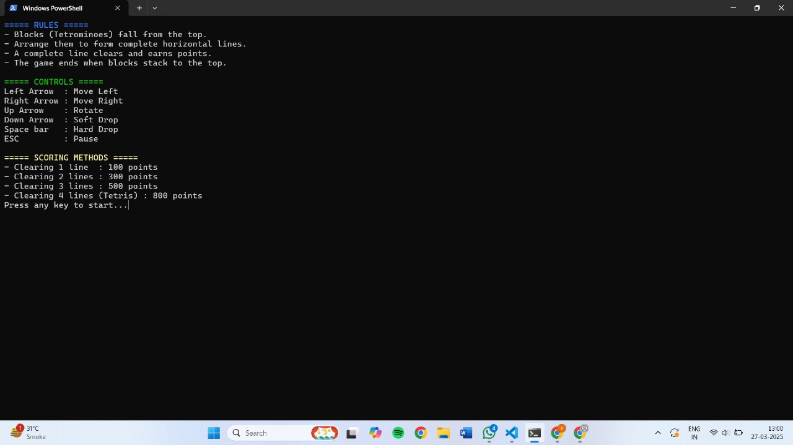

# Tetris Game in C++

## Introduction

This is a console-based Tetris game implemented in C++. The game features classic Tetris mechanics, including various tetromino shapes, rotation, movement, collision detection, **# Line Clearing System**,
and score management. The game runs in the terminal and provides a simple yet engaging experience.

---

## Features

- **Fully Playable Tetris**: The game includes all standard Tetris gameplay mechanics.
- **Multiple Tetrominoes**: Includes seven different Tetris pieces (I, O, T, S, Z, J, L) with proper rotation states.
- **Real-Time Movement & Rotation**: Players can move and rotate tetrominoes using arrow keys.
- **Collision Detection**: Prevents pieces from overlapping or moving out of bounds.
- **Line Clearing System**: Rows are cleared when completely filled, awarding points.
- **Scoring System**: Tracks current and high scores with increasing rewards for multiple lines cleared at once.
-  **Persistent High Score**: Saves and loads the highest score from a file.
-  **Pause and Resume**: Pressing the ESC key pauses the game, allowing players to resume later.
-  **Hard Drop Mechanic**: Instantly drops the current tetromino to the lowest possible position.
-  **<u>Ghost Piece</u>**: Shows where the tetromino will land before dropping.
- **Console Rendering**: Uses ANSI escape codes to display the game board with color-coded tetrominoes.
- **Music and Sound Effects**: The game includes a cachy and addictive music.

---

## Screenshot





---

## Controls

- **Left Arrow (←)** : Move the piece left
- **Right Arrow (→)** : Move the piece right
- **Down Arrow (↓)** : Soft drop (moves the piece down faster)
- **Up Arrow (↑)** : Rotate the piece clockwise
- **Spacebar** : Hard drop (instantly places the piece)
- **ESC Key** : Pause the game
- **Q Key** : Quit the game

---

## How to Run

### Prerequisites

- A C++ compiler (MinGW, MSVC, Clang, or GCC).
- A terminal that supports ANSI escape codes.

### Compilation & Execution

#### Windows:
1. Open a terminal in the project directory.
2. Compile the code using a C++ compiler:
   
   ```sh
   g++ tetris.cpp -o tetris.exe
   ```

3. Run the executable:
   
   ```sh
   ./tetris.exe
   ```

#### Linux/macOS:
1. Open a terminal in the project directory.
2. Compile the code using a C++ compiler:
   
   ```sh
   g++ tetris.cpp -o tetris
   ```

3. Run the executable:
   
   ```sh
   ./tetris
   ```

---

## Code Structure

### 1. Tetromino Class

Manages the shapes and rotation of tetrominoes.

- Tetromino(): Randomly selects a new tetromino.
- rotate(): Rotates the tetromino.
- getColor(): Returns a color code based on the tetromino type.

### 2. GameBoard Class

Handles rendering and storing the game grid.

- displayBoard(): Displays the game board and the current tetromino.
- clearLines(): Checks and removes full rows.

### 3. ScoreManager Class

Manages scoring and high score storage.

- updateScore(int linesCleared): Updates score based on cleared lines.
- saveHighScore(): Saves the highest score to a file.
- loadHighScore(): Loads the highest score from a file.
- showScores(): Shows the current and high scores.

### 4. GameLogic Class

Handles collisions, row clearing, and game-over conditions.

- checkCollision(): Checks if a tetromino collides with existing blocks.
- lockPiece(): Locks a piece into the board.
- clearFullRows(): Removes full rows and shifts everything down.
- hardDrop(): Instantly drops a tetromino to the lowest position.
- showGhostPiece(): Displays the ghost piece position before dropping.

### 5. Input Class

Handles user input.

- readInput(): Reads player keypresses and moves/rotates the tetromino accordingly.

### 6. main() Function

The main game loop that:

1. Initializes objects.
2. Spawns a new tetromino.
3. Loops until game over.
4. Handles user input.
5. Moves tetromino down automatically.
6. Checks for collision and places pieces.
7. Clears full rows and updates scores.

---

## Future Improvements

- **Different Levels**: Increase speed as the game progresses.
- **Multiplayer Mode**: Implement competitive Tetris gameplay.
- **Leaderboard System**: Keep track of multiple high scores.
- **Better UI**: Improve rendering for a more polished look.

---

## Acknowledgments

This project is inspired by the classic Tetris game and was built as a fun programming challenge using C++.

---

